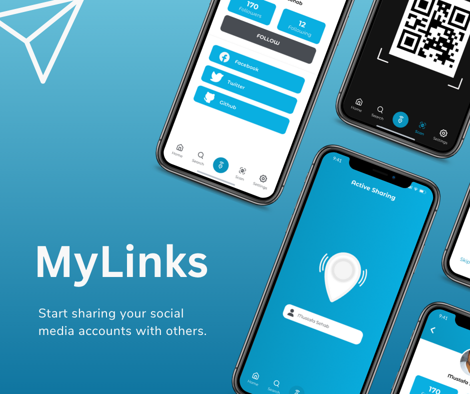

# Betweener App

A social link management application that allows users to create, organize, and share their social media links and profiles. It features a modern UI, QR code sharing, and active profile discovery, built with Flutter and modern architecture.

---

## Table of Contents

- [Features](#features)
- [Architecture](#architecture)
- [ScreenShots](#screenshots)

---

## Features

- **Onboarding**: An engaging onboarding experience to introduce users to the app features.
- **User Authentication**: Secure login, registration, and password management (Forgot/Create Password).
- **Link Management**: unique functionality to add new links, edit existing ones, and manage your social portfolio.
- **QR Code Sharing**: Instantly share your profile or specific links using generated QR codes.
- **Active Sharing**: Discover and share with users in your vicinity or active sessions.
- **Search**: dedicated search capability to find content or links.
- **Profile Management**: customizable user settings and profile options.

---

## Architecture

The project follows a scalable MVC-based architecture with GetX for separation of concerns and reactive state management.

- **State Management**: **GetX** is utilized for efficient state management and logic separation. Controllers in `lib/controllers` handle business logic, decoupling it from the UI.

- **Navigation**: **GetX Navigation** manages routing across the application, providing named routes and smooth transitions defined in `lib/constants/routes.dart`.

- **Networking**: The **Dio** package is used for robust HTTP requests and API handling, configured in `lib/core/network`.

- **Local Storage**: **SharedPreferences** is implemented for persistent storage of user preferences and session data.

- **Utilities**: 
  - **Geolocator**: For location-based features.
  - **QR Flutter**: For generating QR codes.

---

## ScreenShots

